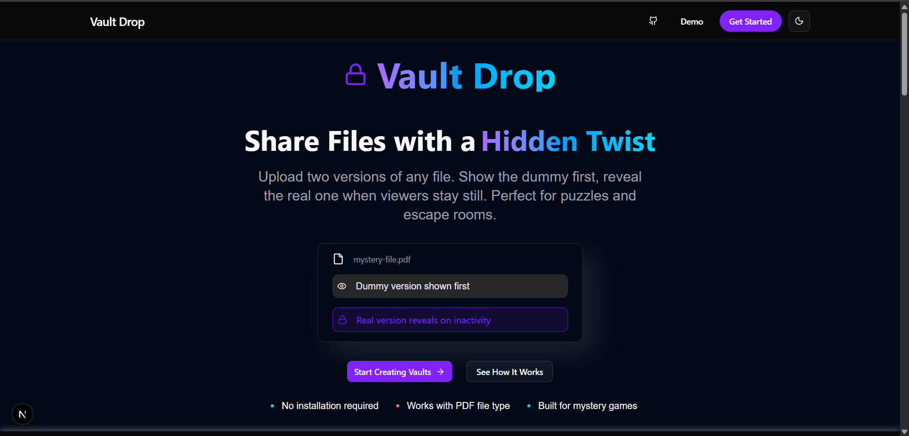
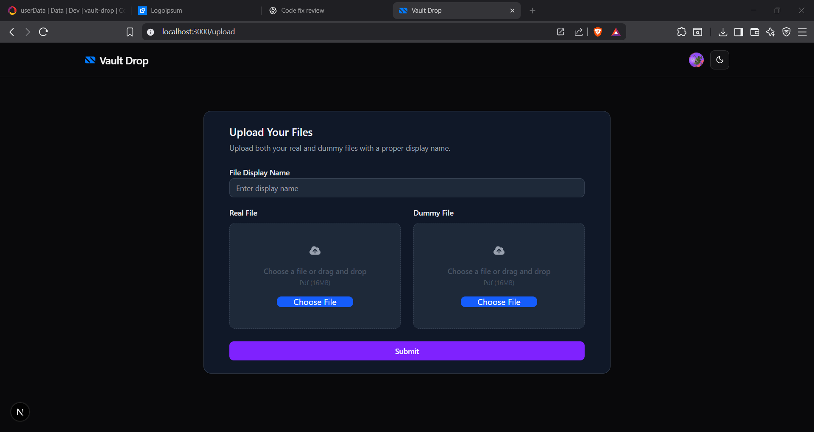
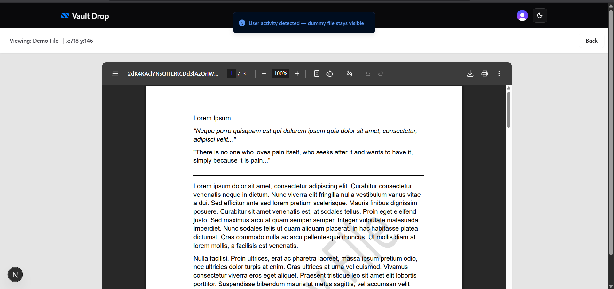
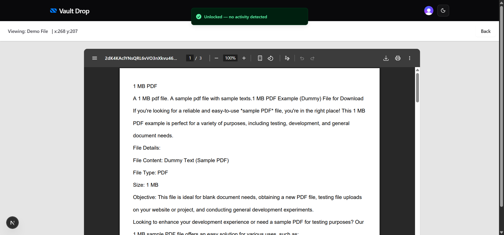
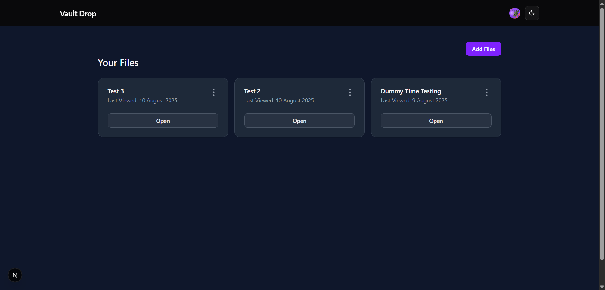
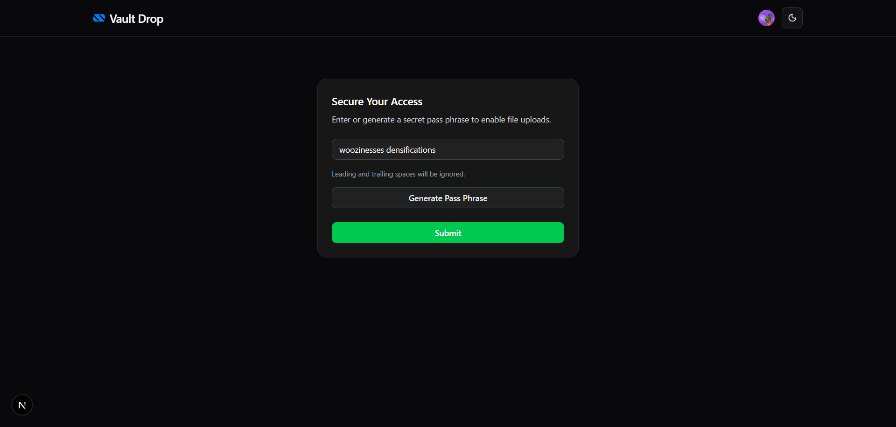
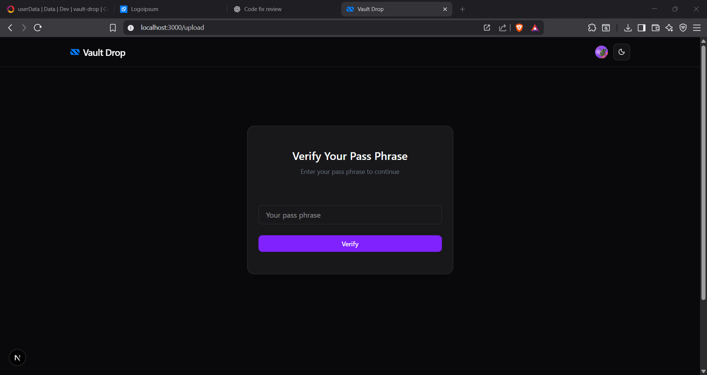

# Vault Drop

A small web app that lets users store two versions of a file — a dummy and the real one. The real file is only shown if the viewer remains inactive for a short period.

---

## Demo

**Live Demo:** [Add your deployed link here]

**Demo Credentials:**

```
Email: demouser@gmail.com
Password: #DemoDragon1

```

---

## Preview

## 📸 Screenshots

**Landing Page**  
The homepage showcasing Vault Drop’s features and purpose.  


---

**File Upload**  
Interface for uploading both real and dummy PDF files.  


---

**Dummy File**  
Shows the placeholder or decoy file that hides the real one.  


---

**Real File**  
Example of the genuine file after unlocking.  


---

**Files Page**  
Dashboard view of all uploaded files, showing only the real ones.  


---

**Generate Pass**  
Form to generate a secure pass for accessing locked files.  


---

**Verify Pass**  
Verification step where the pass is checked before unlocking.  


---

## Project Inspiration

The idea came from imagining a “spy scenario” where sensitive files are protected by a patience test. If an intruder or curious person quickly interacts with the file, they only see a harmless dummy version. However, if they wait without any action, the real file is revealed. This concept seemed like a fun way to mix simple inactivity detection with a bit of storytelling. I thought it would also fit well in puzzle games or escape rooms, where “Patience is the key” can be part of the challenge.

---

## How It Works

1.  Users log in using Clerk authentication.
2.  They can view their existing files or add new ones.
3.  Adding a file requires entering a pass key (create or enter an existing one).
4.  Each file consists of:

    - **Dummy file**: Shown first.
    - **Real file**: Revealed only if the viewer remains inactive for a set time. (now its 15 seconds)

5.  If any mouse, keyboard, or scroll activity is detected during that time, the dummy file remains visible.

---

## Tech Stack

- **Frontend:** Next.js, ShadCN UI
- **Backend:** Convex
- **Authentication:** Clerk
- **State Management:** Zustand

---

## Use Cases

- Puzzle games and escape rooms.
- Fun hidden content demos.

---

## Setup

1.  Clone the repository:

    ```bash
    git clone [your-repo-link]
    cd vault-drop

    ```

2.  Install dependencies:

    ```bash
    npm install

    ```

3.  Create a `.env.local` file and add your credentials for:

    - Clerk
    - Convex

4.  Run the development server:

    ```bash
    npm run dev

    ```

5.  Open `http://localhost:3000` in your browser.

---
